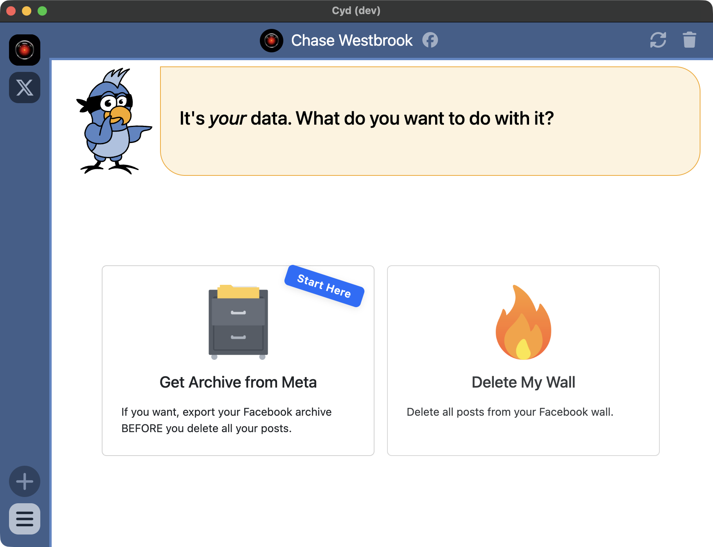

# Dashboard

:::warning[Beta Feature]

These features are under beta testing right now and not available in the latest release.

:::

After signing in to your Facebook account, you'll see that the main panel shows you a Dashboard that allows you to naviate between these options:

- [Get Archive from Meta](./get-archive.md)
- [Delete My Wall](./delete)

If you care about what you've posted to Facebook over the years, then make sure to save an archive from Meta before you delete it all. If you really don't care, go forth and delete your data from Facebook!

