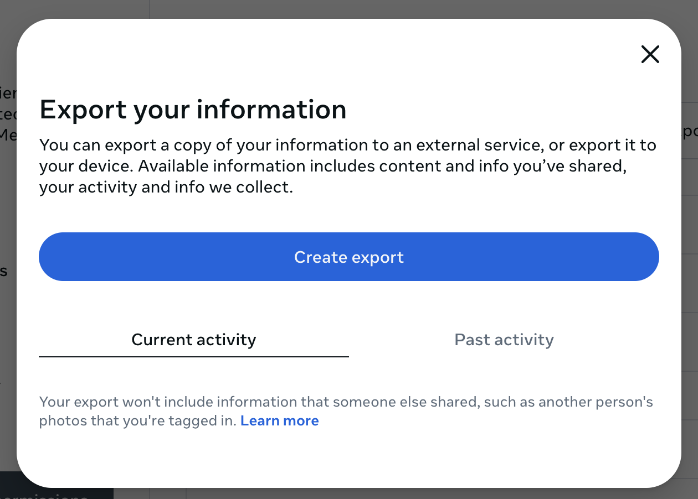
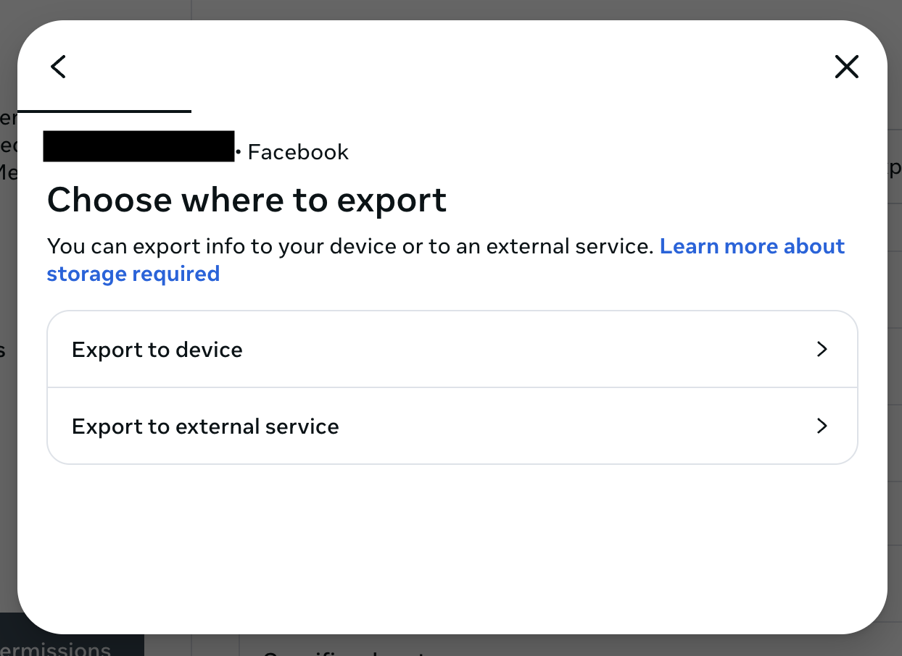
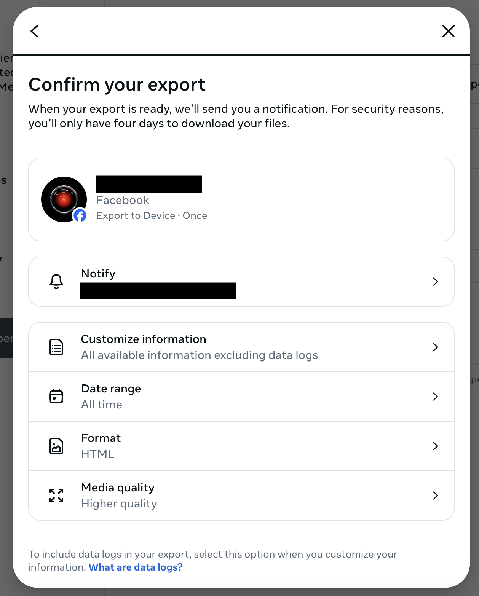

# Get Archive from Meta

:::warning[Beta Feature]

These features are under beta testing right now and not available in the latest release.

:::

If you don't want to lose your historical Facebook data, export your Facebook archive _before_ deleting your Facebook posts! If you don't care about your old posts, skip this step.

To get your Facebook archive from Meta, visit the [**Export your information**](https://accountscenter.facebook.com/info_and_permissions/dyi) page on Meta's Account Center.

With **Current activity** selected, click **Create export**.

This will bring you to the **Choose where to export** screen:

On this screen, you have these choices:

- **Export to device**: Save your Facebook archive to your computer. If you're not sure, choose this one.
- **Export to external service**: Save your Facebook archive to another service like Dropbox, Google Drive, or several other choices.

When you click **Export to device**, you get to the **Confirm your export** screen:

On this screen, you get to choose exactly what to export. If you want to make sure you get everything, choose the following options:

- **Customize information**: All available information excluding data logs
- **Data range**: All time
- **Format**: HTML
- **Media quality**: Higher quality

When you're ready, scroll down and click **Start export**. You may be prompted to re-enter your Facebook password.

You will see a message like:

> Your information is being prepared for export. We’ll let you know when it’s ready.

You should receive an email or text message from Facebook when your archive is ready to be saved. **Don't start deleting your Facebook posts using Cyd until after you have saved your archive.**
