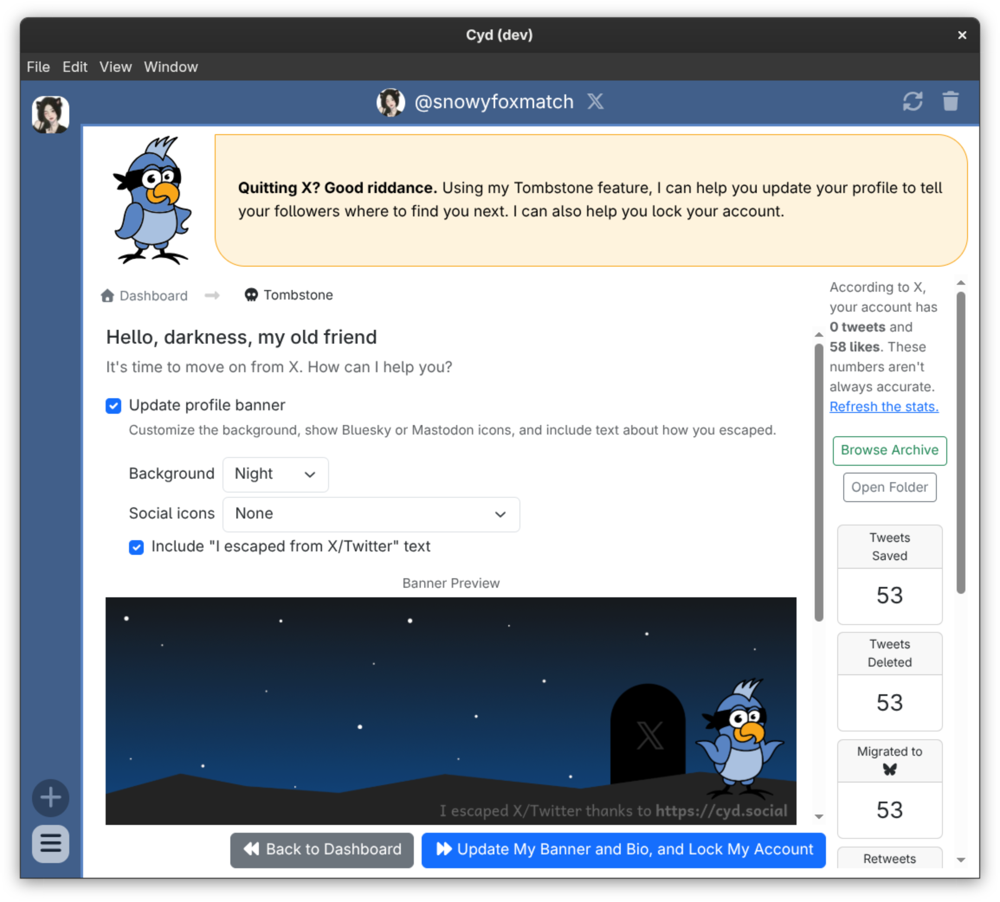
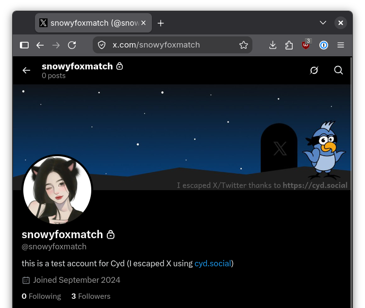

# Tombstone

Cyd makes it simple to quit X for good. Use the Tombstone feature to automatically update your profile banner and bio, and to lock your account for good.

## Tombstone Options

Here are the options for personalizing your X funeral:

### Update profile banner

If you want to update your banner, you can choose between these a night sky background or a morning sky background. You can choose to include social icons for Bluesky, Mastodon, or both. You can choose to include the text "I escaped from X/Twitter thanks to https://cyd.social" in the image.

### Update bio text

Tell people where they can still find you on the internet here.

Optionally, you can automatically include the text, "(I escaped X using https://cyd.social)" to the end of your bio.

### Lock your account

Automatically enable the "Protect your posts" feature, so only your followers can see any posts in your timeline.

## A Tombstoned Account

After tombstoning your account, your bio will look something like this:

