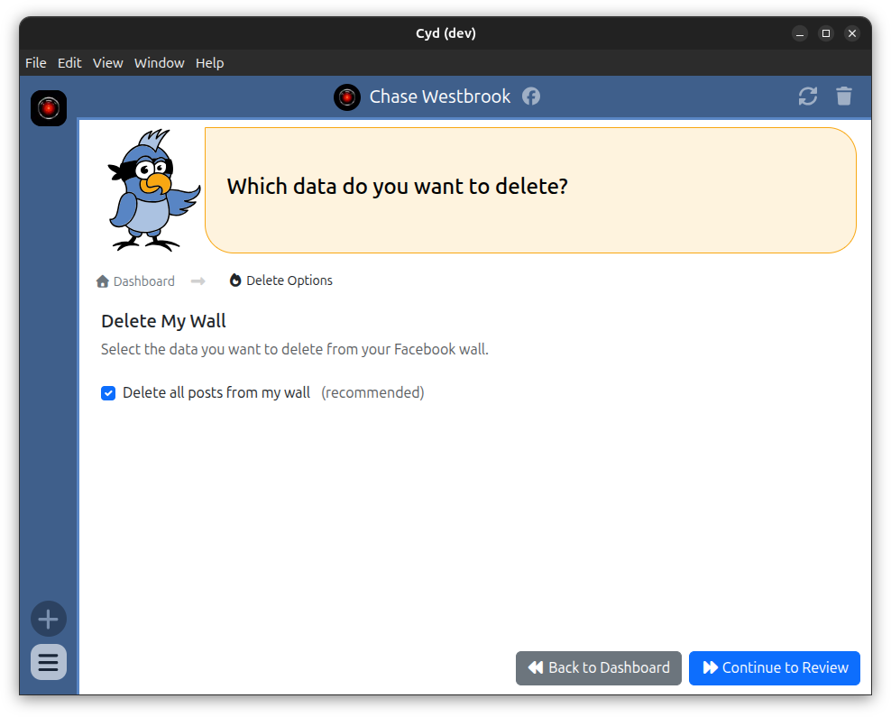
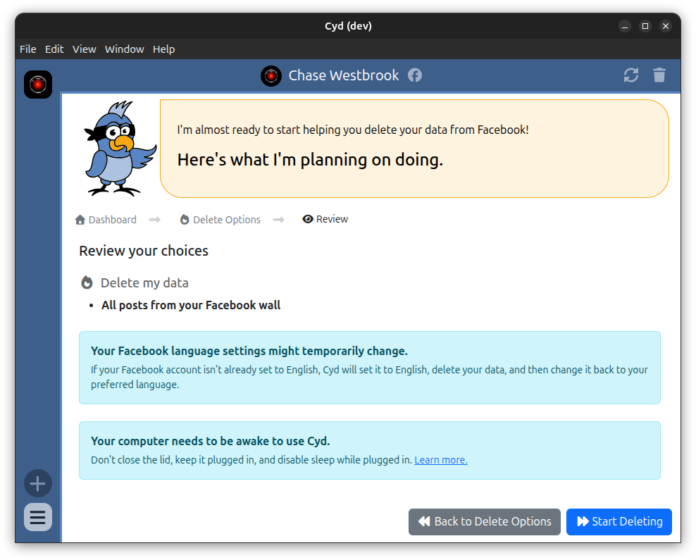
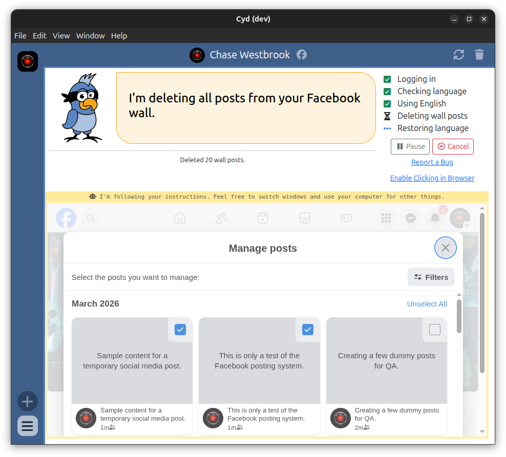

# Delete My Wall

:::warning[Beta Feature]

These features are under beta testing right now and not available in the latest release.

:::

With Cyd, you can delete all of the posts on your Facebook wall!

Some of the Delete Options require a Premium plan - [learn more about Premium plans here](../premium/intro).

## Delete Options

After signing into your Cyd account with a Premium plan, you will see the following Delete Options screen.

For now, the only option is to delete all posts from your Facebook wall. In the future, Cyd will be able to delete other types of data from Facebook as well, like comments.

## Review

When you click **Continue to Review**, you have a chance to review your options before proceeding:

When you're ready, click **Start Deleting**.

## Deleting

Cyd will use Facebook's Manage Posts feature to delete every post on your wall that can be deleted.

:::info Your language settings might temporarily change

Cyd requires that your Facebook language be set to English while it's deleting your data. If your language isn't English, Cyd will change it to English, delete your data, and then change it back.

:::

Some updates, such as when you update your profile image, cannot be deleted.

## Finished

When Cyd is done deleting your data, it will show you a summary of what it deleted.