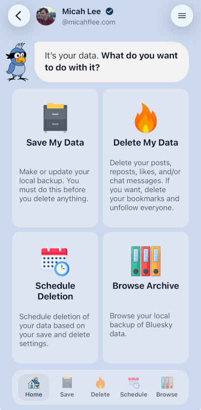
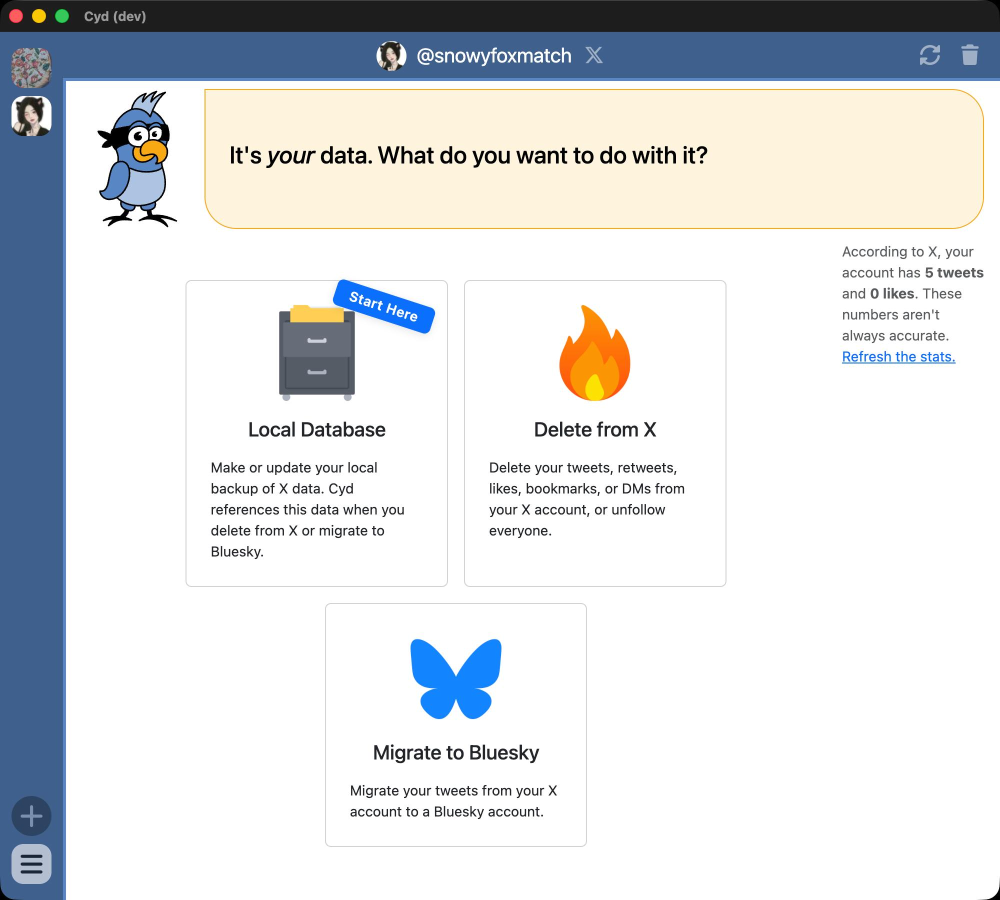

# Welcome to Cyd

Cyd is an open source app that makes it easy for you to **Clawback Your Data** from tech platforms.

- [Cyd for Mobile](/docs/mobile/download) supports **Bluesky**.
- [Cyd for Desktop](/docs/desktop/download) supports **X (formerly Twitter)**, with **Facebook** coming soon.

Cyd helps you create a local, private backup of your data &mdash; like all of your posts, likes, bookmarks, and direct messages. Once you've done this, Cyd helps you choose what data you want to delete from your online account. You can delete it all, or you can be selective, deleting most of it but keeping what went viral.

## Should I Use Mobile or Desktop?

If you want to automatically delete your old likes, reposts, chat messages, and low-engagement posts from **Bluesky**, keeping only what you actually want to publicly highlight on your account, then **start with [Cyd for Mobile](/docs/mobile/download).**

If you want to back up and delete your data from **X**, such as tweets, likes, and direct messages, and optionally migrate them to Bluesky, then **start with [Cyd for Desktop](/docs/desktop/download).**

## Why Delete Your Data from Tech Platforms?

The tech platforms that we all rely on are controlled by a tiny group of powerful billionaires like Elon Musk, Mark Zuckerberg, and Jeff Bezos. It's increasingly clear that they're not working in the interest of their users. You don't need to give them permanent access to your data. Especially not now, while they're cashing in on the AI boom by selling your data to AI companies to train their models, all without compensating you.

The content that you've been posting to social media for years isn't just enriching billionaires, it's also a privacy nightmare. Most people have an endless trail of [OSINT](https://en.wikipedia.org/wiki/Open-source_intelligence) crumbs about them across the internet, waiting to be exploited.

Many of us go out of our way to protect our privacy. We install ad blockers to prevent surveillance capitalists from tracking our every move online. We use encrypted messaging apps like Signal and enable disappearing messages so that we don't have permanent histories of all of our conversations on our phones.

Why should our social media posts, or for that matter our product reviews, ratings, comments, and upvotes, remain on the internet forever?

If you've had an online presence for a long time, it might be a good idea to see what you've posted in the past and delete everything that you don't want out there. This is especially true if you're an activist, a journalist, a parent, or work for a company or non-profit that some people don't like. If you run a business, you might consider [providing this service to your employees](/docs/cyd-for-teams/intro) as a benefit.

If you're one of the millions of people fleeing the X platform, it's better to delete all of your tweets (and unfollow everyone) but keep your account activated than to delete your account. This way, other people can't take over your username and impersonate you, and you can leave your account with a message telling your followers where to find you.

## How Cyd Works

- **Install** — Get Cyd for Mobile for Bluesky, or Cyd for Desktop for X.
- **Login** — Connect your account.
- **Back up** — Cyd saves a local, private copy of your data.
- **Delete** — Tell Cyd exactly what you want removed. Sit back and watch as Cyd does exactly what you ask.

| | Cyd for Mobile (Bluesky) | Cyd for Desktop (X) |
|---|---|---|
| **What you can delete** | Posts, reposts, likes, chat messages, bookmarks; unfollow everyone | Tweets, likes, bookmarks, direct messages; unfollow everyone |
| **Extra features** | Delete your data on a schedule to keep your account ephemeral | Migrate your old tweets to Bluesky |

## We Can't Access Your Accounts or Your Data

Cyd runs directly on your device and not on our servers. Cyd is designed so that we don't have access to your accounts, or to any of your data in those accounts.

---

Ready to get started? Download [Cyd for Mobile](/docs/mobile/download) or [Cyd for Desktop](/docs/desktop/download).
