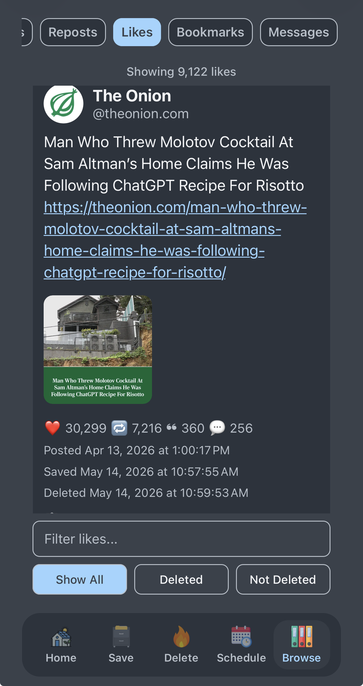

# Browse Archive

Within Cyd, you can browse the local archive of your Bluesky data that you saved. The types of data that you can browse include:

- Posts
- Reposts
- Likes
- Bookmarks
- Messages

When you save Bluesky data, Cyd also saves images, videos, link previews, and quote posts. For every post, you can copy it's original URL, even if it's already been deleted.

If you come across a post or a message that you want to preserve from deletion, you can mark it as preserved, and Cyd will not delete it.

You can show all posts, or filter by what's been deleted, or what hasn't been deleted. You can also do keyword searches of posts.

Each post includes a timestamp for when it was posted, when Cyd saved it, and, if it's been deleted, when Cyd deleted it. For example, here is a like that has been deleted:

## Exporting Archives

You can export your Bluesky archive by clicking the ☰ button in the top-right and choosing **Export Bluesky archive**. This creates a ZIP file containing your archive and then shares it with another app.

For example, you can send it to yourself in a Signal message, you can transfer it to an email or cloud storage app, or send save it some other way.

Your Bluesky archive is structured data, so if you're a nerd, you can work with it yourself. It contains the following files and folders:

- `data.db`: A SQLite database of all of the data Cyd has related to this Bluesky account
- `metadata.json`: Metadata related to this Cyd account, including the Bluesky username and when the export was created.
- `media`: A folder for all media files, such as images and videos, that are associated with the export.

## Importing Archives

If you have a copy of your Bluesky archive and you'd like to import it into Cyd:

- Go to the account selection page of Cyd by clicking the ❮ button in the top-left.
- Click the ☰ button in the bottom-right corner and choose **Import Bluesky archive**, and browse for the archive ZIP file on your phone.

You cannot import an archive for a Bluesky account that you've already added to Cyd. Delete the existing Bluesky account before importing an old archive.
