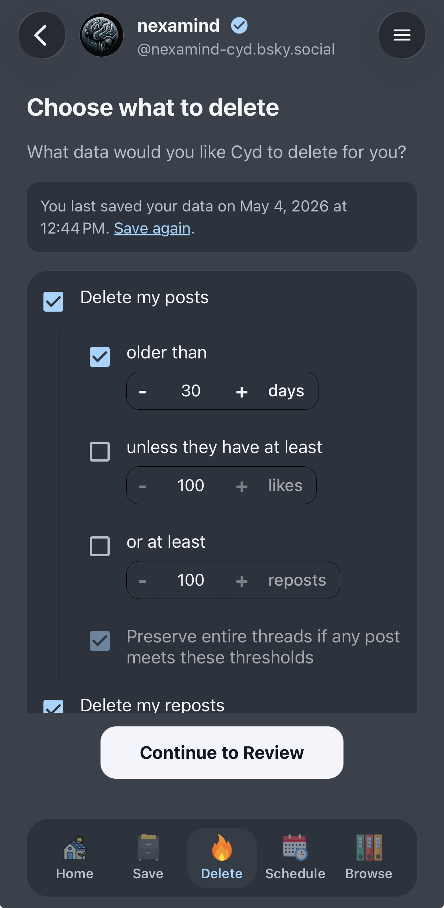
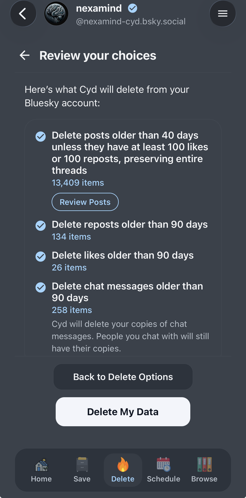
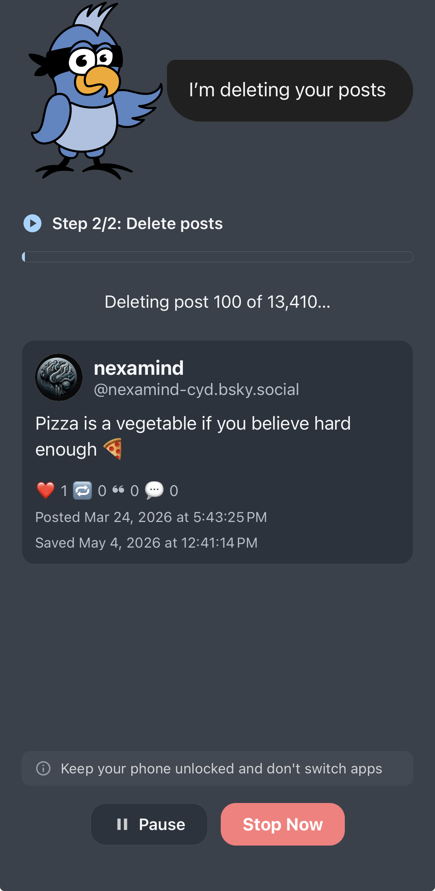
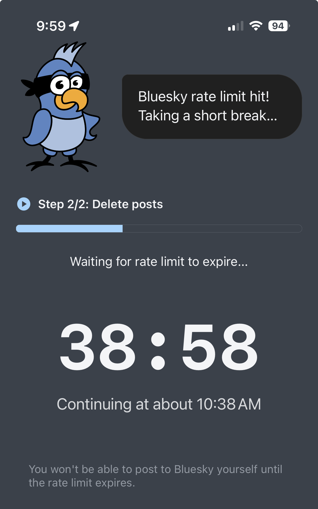

# Delete My Data

Deleting data is where Cyd really shines. Before you can delete data, make sure that you've [saved your data](./save) first.

:::info[Deletion is a Premium Feature]

You can save your Bluesky data and browse your archive for free, but deleting data requires a [premium account](../premium/intro).

You can create or sign into a Cyd account directly within the app using your email address. Once you've paid for a premium plan, all premium features are unlocked for as many Bluesky accounts as you'd like.

:::

## Choose What You Want to Delete

Here's what the delete options look like:

You can delete the following data:

- **Delete your posts.** If you want, you can only delete older posts by setting a days threshold. You can also keep the posts that had engagement or went viral by setting likes or reposts thresholds, and delete all the other cruft. You can also choose to keep your threads intact.

  For example, you can delete all posts older than 30 days unless they received at least 100 likes.
- **Delete your reposts.** You can set a days threshold if you want.
- **Delete your likes.** You can set a days threshold if you want.
- **Delete my chat messages.** You can set a days threshold if you want. Note that this only deletes the messages on _your side_ of the conversation.
   
   So, if someone hacks your account, your messages won't be there, but if someone hacks the other person's account, they will be there.
- **Delete my bookmarks.**
- **Unfollow everyone.** You probably only want to do this if you're completely cleaning out your account.

## Review Your Choices

After choosing what you want to delete from your Bluesky account, Cyd will show you a preview of what it plans on deleting. It will summarize your deletion settings and tell you the amount of each type of data it delete, like this:

:::info[Bluesky Rate Limits]

**Bluesky enforces a rate limit of up to 5,000 deletions per hour.** If you're deleting more than 5,000 posts, likes, or bookmarks, the review page will also show you an estimate of how long it will take to finish.

:::

If you're deleting posts, you can click **Review Posts** to manually scroll through all of the posts that you're about to delete. You can click the **Preserve** button on any post you want to preserve, and Cyd will not delete it.

When you're ready to proceed, click **Delete My Data**.

## Deleting Your Data

Cyd will immediately start deleting all of the data you chose to delete, as quickly as the Bluesky API allows. You can watch as Cyd deletes each post.

:::info[Keep Cyd open]

Keep the Cyd app open while automation is progress. Cyd cannot run in the background.

:::

Clicking **Pause** will temporarily pause the automation, which you can later resume. Clicking **Stop Now** will stop the automation. If Cyd has already deleted data, stopping the automation won't restore that data.

The first time you delete your data it might take a long time, especially if you have over 5,000 posts or likes and Cyd hits Bluesky's rate limits.

### Bluesky Rate Limits

If Cyd hits a Bluesky rate limit, Cyd will show you a countdown of exactly how long you need to wait before you can continue deleting your data, like this:

While you're being rate limited, you likely won't be able to post or delete data within the normal Bluesky app either.

You might want to pause automation and use your phone for other things, and then come back and resume after the rate limit has expired.

## Finished Deleting

