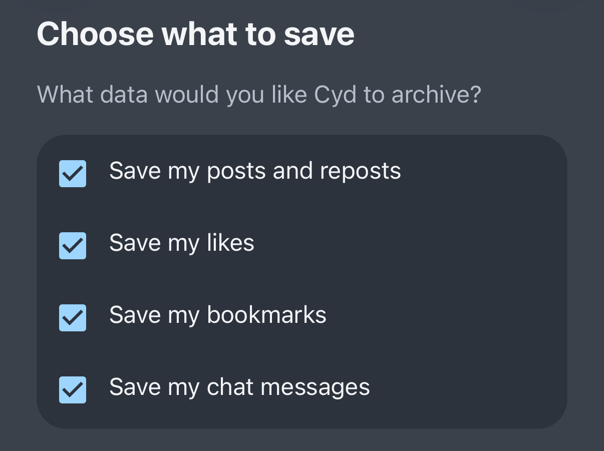
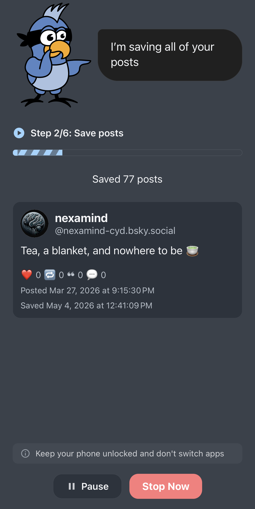
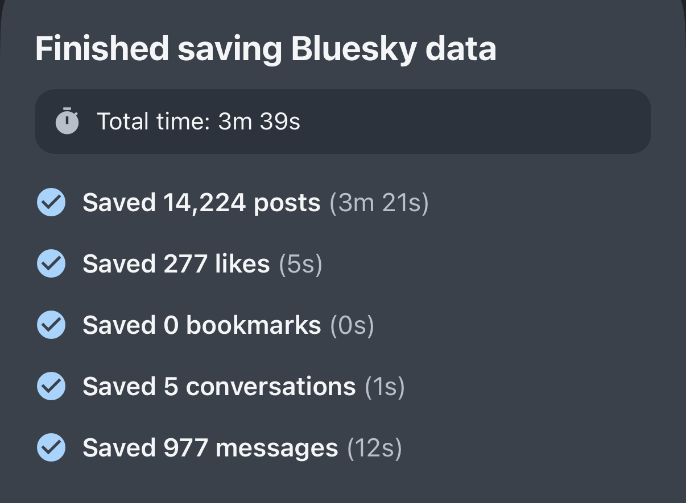

# Save My Data

Before you can delete data, Cyd needs to save a local archive of it. Choose which times of data you'd like to save, and click **Continue to Review**:

Before Cyd starting saving your data, confirm that this is what you want. When you're ready, click **Save My Data**.

Cyd will immediately start downloading all of the data you chose to save, as quickly as the Bluesky API allows. You can watch as Cyd downloads each post.

:::info[Keep Cyd open]

Keep the Cyd app open while automation is progress. Cyd cannot run in the background.

:::

Clicking **Pause** will temporarily pause the automation, which you can later resume. Clicking **Stop Now** will stop the automation.

When Cyd is finished saving your data, it will show you a summary of what was saved:

From this point, you can move on to [delete your data](./delete), or you can [browse the archive](./browse) that you just created.