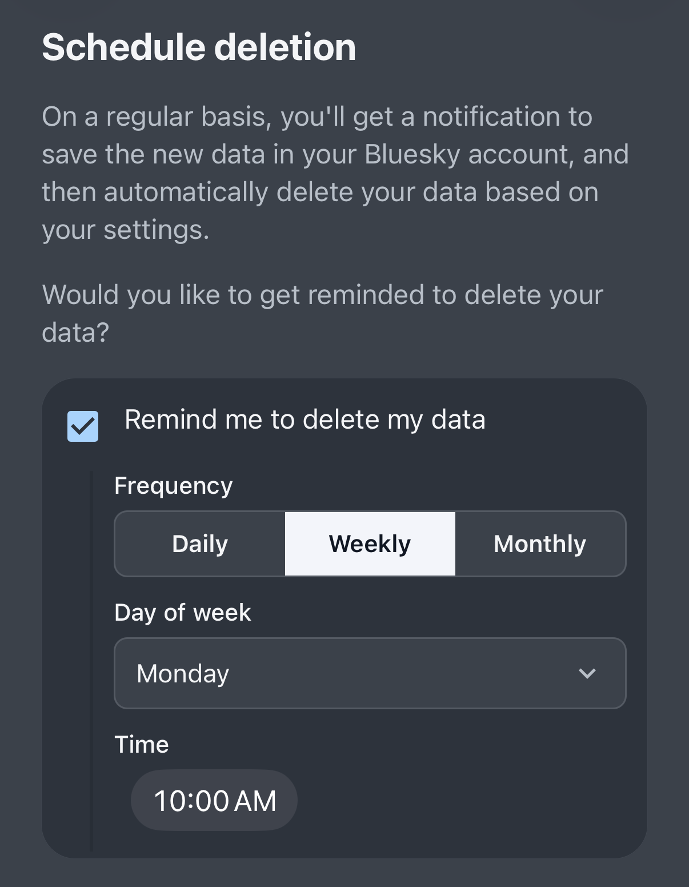
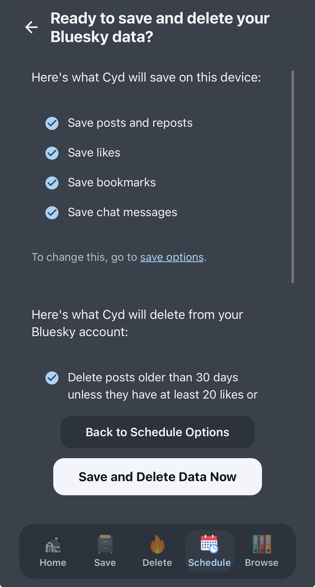

# Schedule Deletion

After you've [saved your data](./save) and [deleted your data](./delete) for the first time, you can schedule data deletion. Scheduled deletion simply saves and deletes your data again, on a schedule, using your saved settings.

## Pick a Schedule

To schedule deletions, first select **Remind me to delete my data**, and allow Cyd to send push notifications to your phone. Then, choose exactly how often you want to delete your data.

You can choose to get deletion reminders daily, weekly, or monthly, and exactly when.

To try it out immediately, click **Save and Delete Data Now**.

## Saving and Deleting Data

When you open a deletion reminder notification, or when you click **Save and Delete Data Now**, you get to review your preferred save and delete settings before continuing.

When you're ready, click **Save and Delete Data Now** to start the automation.

Cyd will immediately start saving all of your data, and soon as that's done, immediately start deleting your data.

When the automation is done, it will show you a summary of what was saved and what was deleted.

We recommend that you schedule deletion reminders on a regular basis to keep your Bluesky account clean of cruft!
