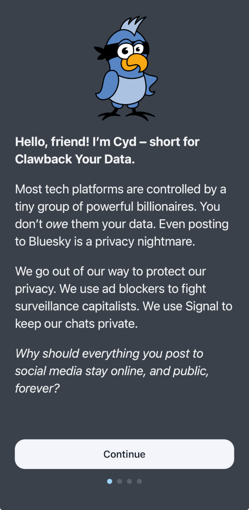
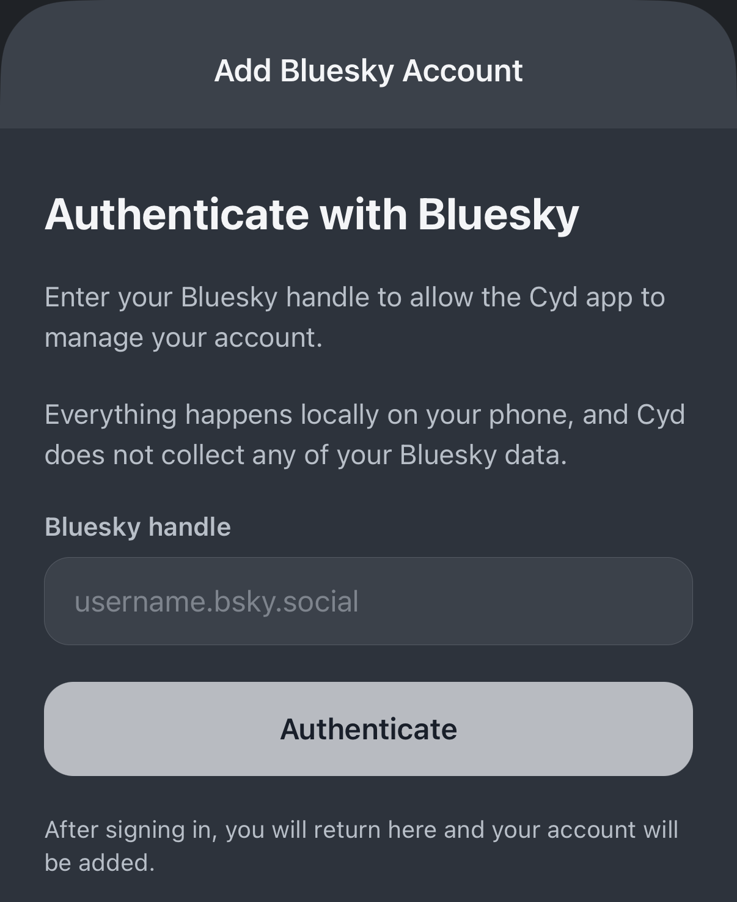
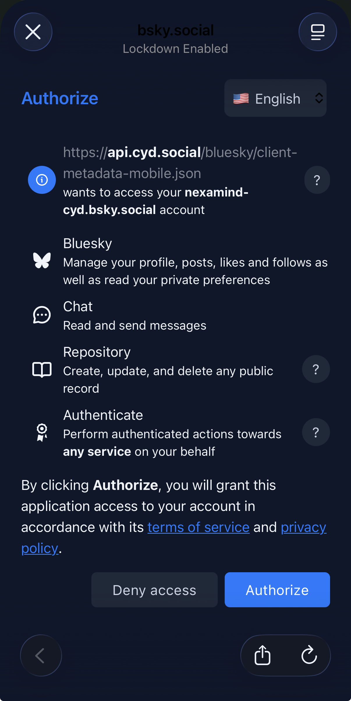
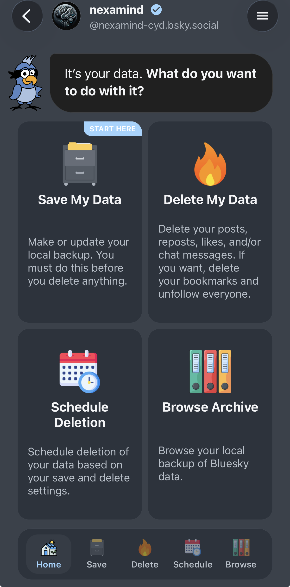

# Tour of Cyd for Mobile

When you open Cyd for the first time, you'll see an onboarding wizard that explains the features of the app.

## Add a Bluesky Account

To start, you add your Bluesky account to Cyd. You can add as many accounts as you want.

:::tip[Don't worry, you're not sharing your data with us]
You're giving the _app on your phone_ access to your Bluesky account. The developers of Cyd can't access your data.
:::

Type in your Bluesky handle, typically _username.bsky.social_.

A browser will open to continue signing into Bluesky. After signing in, click **Authorize** to authorize Cyd to access you Bluesky account.

### Features

When you select a Bluesky account, you'll see the the following page:

You can click the **❮** button in the top-left to get back to the list of your other accounts. You can click the **☰** button in the top-right to open the menu for advanced features.

Cyd helps you save data, delete data, schedule deletion, and browse the archive of your saved data. Some of the features are free, and some require a [premium account](../premium/intro.md):

- [Save My Data](./save)
- [Delete My Data](./delete) (Premium)
- [Schedule Deletion](./schedule) (Premium)
- [Browser Archive](./save)

You can quickly switch between these features using the tabs at the bottom of the screen.

To get started, [save your data](./save).